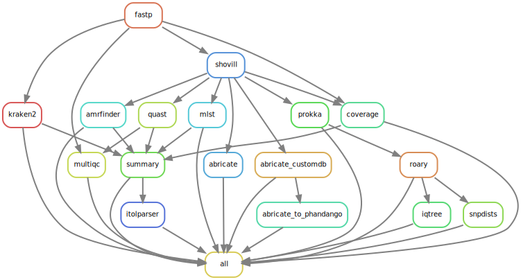

# Genomic epidemiology of zoonotic S. suis in Europe

This repo contains a Snakemake pipeline used for a preliminary analysis of WGS data of S. suis isolates associated with human disease, collected from European reference laboratories.

